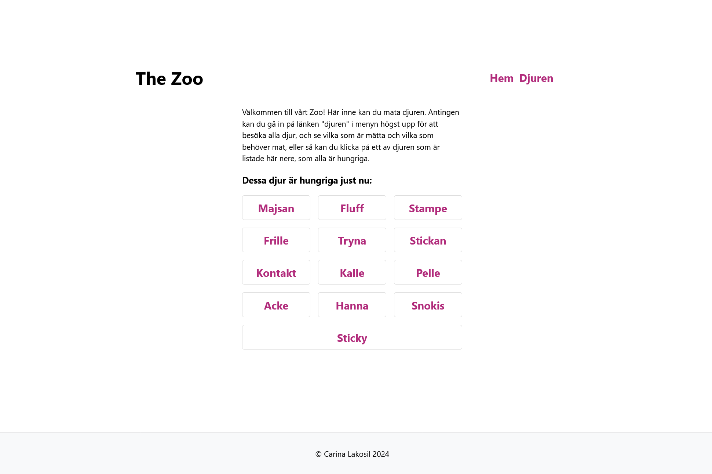
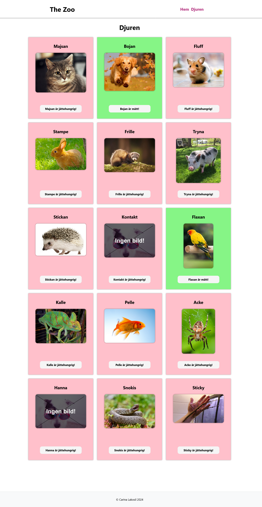
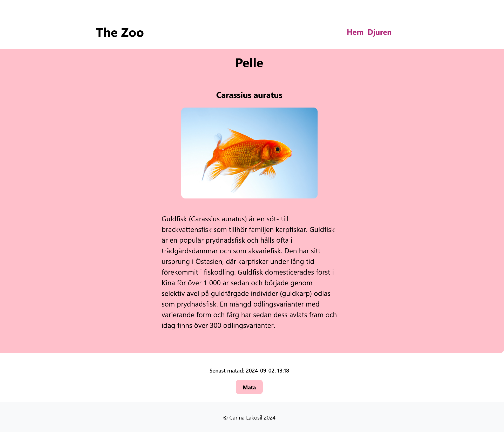

### Förstasidan, Här kan man se vilka djur som är hungriga just nu, och gå in på ett av dem: 


### Välj ett av djuren. Rosa indikerar hunger, gult går att mata, men inte så hungrigt, grönt indikerar mättnad och går inte att mata:


### Ett djurs sida där man kan mata det:


### En placeholder image syns om det saknas en bild:


Den här sidan är gjord i React med TypeScript och VITE. Det var en skoluppgift som vi fick augusti 2024 när vi lärde oss React. Den går ut på att mata de djur som är hungriga genom att klicka på dem. Vi fick en adress till ett api, men djuren ska vi lagra i localStorage, och de är mätta i tre timmar efter att man klickat på dem, sen ska de bli hungriga.  


Projektet är inte deployat, vilket innebär att det inte går att se i en browser. Det går utmärkt att titta på själva koden här. 


[](https://classroom.github.com/a/Fj2E3Yxb)
# The Zoo - Uppgift


# React + TypeScript + Vite

This template provides a minimal setup to get React working in Vite with HMR and some ESLint rules.

Currently, two official plugins are available:

- [@vitejs/plugin-react](https://github.com/vitejs/vite-plugin-react/blob/main/packages/plugin-react/README.md) uses [Babel](https://babeljs.io/) for Fast Refresh
- [@vitejs/plugin-react-swc](https://github.com/vitejs/vite-plugin-react-swc) uses [SWC](https://swc.rs/) for Fast Refresh

## Expanding the ESLint configuration

If you are developing a production application, we recommend updating the configuration to enable type aware lint rules:

- Configure the top-level `parserOptions` property like this:

```js
   parserOptions: {
    ecmaVersion: 'latest',
    sourceType: 'module',
    project: ['./tsconfig.json', './tsconfig.node.json'],
    tsconfigRootDir: __dirname,
   },
```

- Replace `plugin:@typescript-eslint/recommended` to `plugin:@typescript-eslint/recommended-type-checked` or `plugin:@typescript-eslint/strict-type-checked`
- Optionally add `plugin:@typescript-eslint/stylistic-type-checked`
- Install [eslint-plugin-react](https://github.com/jsx-eslint/eslint-plugin-react) and add `plugin:react/recommended` & `plugin:react/jsx-runtime` to the `extends` list
